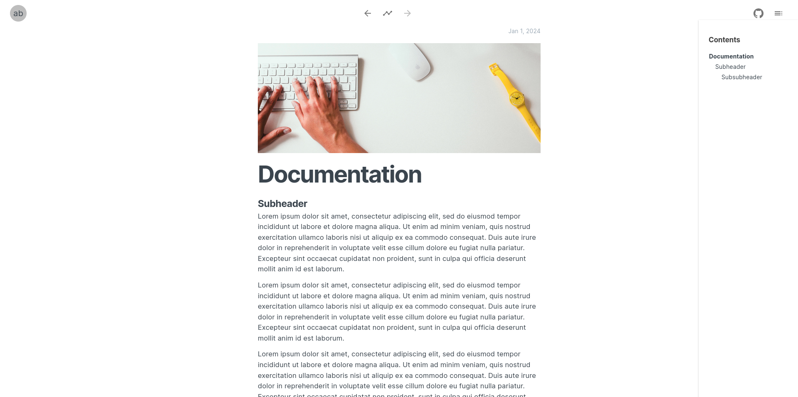
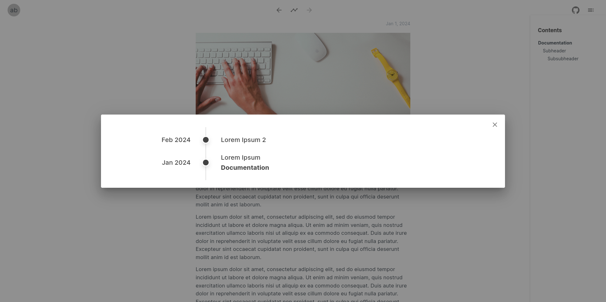

# re/blog
A simple client-side markdown blog engine, built for fun! Not SEO optimized.

## Features
Clean default interface with a content navigation pane, which allows users to skip to specific sections.

Navigation through timeline, or by using the previous/next arrows.

## Tasks
 - [ ] Add support for cache invalidation.
 - [ ] Add build tasks that would make it easier to publish/deploy the blog.
 - [ ] Create global configuration file to allows users to do things such as set the avatar image, blog name.
 - [ ] (?) Add metainformation panel.
 - [ ] (?) Add support for comments.
